# VVE3 引擎教程——自定义物理小车

> 本教程讲解如何使用VVE3引擎在Minecraft 1.21.5~26.2中制作自定义物理小车。首先下载所需库和模块构建器MOT，制作三态小车模型并配置物品模型映射。接着安装数据包、初始化环境，构建blue_car模块。通过调整物理参数、四元数旋转和碰撞点对齐，使模型与物理体匹配。搭建模拟器后，可生成可驾驶小车。教程还演示了添加方向盘转向动画、声音程序以及撞击伤害机制，最终实现一辆完整可交互的物理载具。

**适用版本：1.21.5 ~ 26.2**

---

## 一、下载依赖

- **VVE 本体 3.0.3**  
  https://github.com/xiaodou8593/vve3.0

- **VVE3 资源包**  
  https://github.com/xiaodou8593/vve3.0_rp

- **数学库 3.1.4**  
  https://github.com/xiaodou8593/math3.1

- **线性代数库 3.1.4**  
  https://github.com/xiaodou8593/math3.1_lalib

- **图形库 3.1.4**  
  https://github.com/xiaodou8593/math3.1_gelib

- **模块构建器MOT**（需要python）

```
pip3 install mcf-mot
```

---

## 二、制作小车模型

使用 3D 建模软件（如 BlockBench）制作小车的模型。

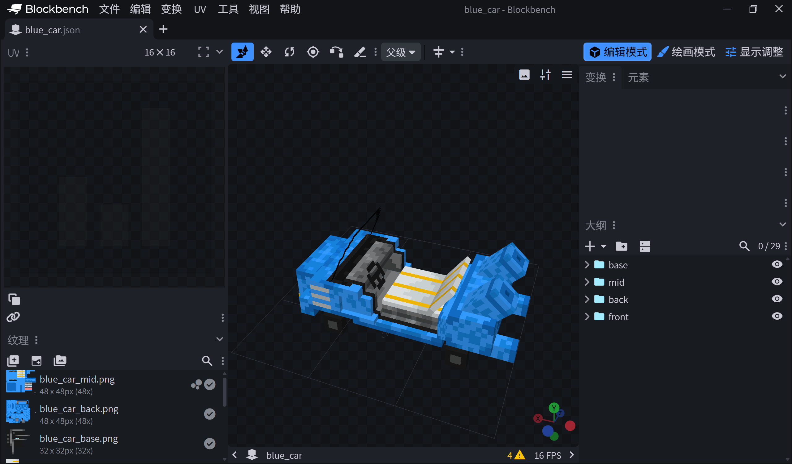

### 建模注意事项

1. 需要制作**三份**模型，分别用于：
   - 前进状态
   - 方向盘左转状态
   - 方向盘右转状态

2. 模型的**质心位置**需要与中心对齐。如果后续在游戏中发现中心没对齐，需要偏移；也可以在显示调整 → 物品展示框中调整位置。

> 资源包制作教程本文略，可参考：
> - https://zh.minecraft.wiki/w/Tutorial:%E5%88%B6%E4%BD%9C%E8%B5%84%E6%BA%90%E5%8C%85
> - 【复刻计划】爆肝3000字！阿乔也能看懂的物品模型映射教程（MC1.21.4）  
>   https://www.bilibili.com/video/BV1w5FEejEra/

在新版本资源包中，您需要为物品模型创建一个**物品模型映射**，可以参考教程示例数据包 `model_practice/assets/xiaodou123/items/blue_car.json` 的写法：

```json
{
    "model": {
        "type": "range_dispatch",
        "entries": [
            {"threshold": 0.0, "model": {"type": "model", "model": "xiaodou123:blue_car"}},
            {"threshold": 1.0, "model": {"type": "model", "model": "xiaodou123:blue_car_left"}},
            {"threshold": 2.0, "model": {"type": "model", "model": "xiaodou123:blue_car_right"}}
        ],
        "property": "custom_model_data"
    }
}
```

使用 `custom_model_data` 索引三个不同状态的模型：
- `0.0` → 前进状态
- `1.0` → 左转方向盘状态
- `2.0` → 右转方向盘状态

---

## 三、安装数据包

将 `vve3`, `math3`, `math3` 线性代数库, `math3` 图形库放入存档 `datapacks` 文件夹下。

在 MC 游戏中进入存档，聊天栏输入命令：

```
/reload
```

然后初始化各个数据包：

```
function math:_init
function math:_init_la
function math:_init_ge
function math:particles/_load_1214
function vve:_init
```

寻找一个空旷的位置作为 VVE 测试坐标：

```
function vve:test_coord/_set_here_align
```

---

## 四、构建模块

在存档的 `datapacks` 文件夹下创建一个新数据包。本文使用的包名和命名空间均为 `vve_tutor`，您也可以使用自定义名称。

在新建好的数据包 `function` 文件夹内，新建一个文件夹 `blue_car`（可自定义名称），这个文件夹被我们称之为一个**模块**。

在 `blue_car` 文件夹窗口下，按住`Shift`+右键，打开powershell或者终端。

输入以下命令运行mot：

```
mot
```

推送 `vve_vehicle_lite_1.0` 模板：

```
push vve_vehicle_lite_1.0
```

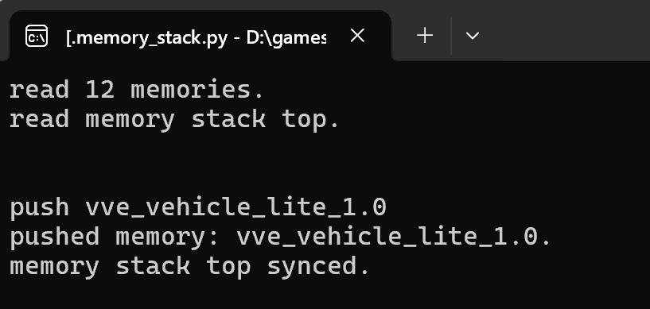

依次输入以下命令构建模块：

```
mcfo
run
init
sync
stop
pop
```

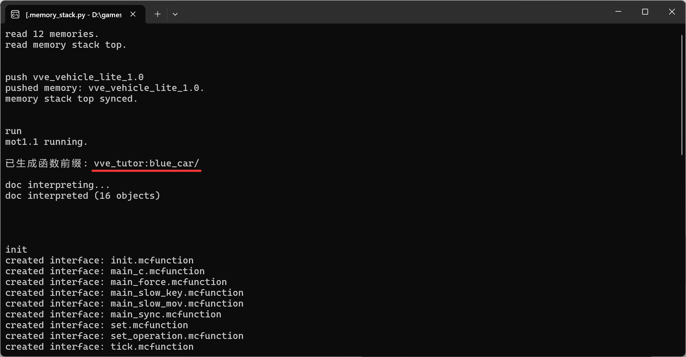

请检查函数前缀是否相符。

接下来继续在 MOT 为 `blue_car` 模块构建自动测试。

首先推送自动测试模板 `vve_test_1.0`：

```
push vve_test_1.0
```

然后像刚才那样构建模块：

```
run
init
sync
stop
pop
```

最后结束 MOT 运行：

```
stop
```

---

## 五、模型对齐

打开模块下的 `set_operation` 函数，将物体的模型引用制作的小车模型。

第 8 行修改为：

```mcfunction
item replace entity @s container.0 with minecraft:clay_ball[minecraft:item_model="xiaodou123:blue_car",minecraft:custom_model_data={floats:[0.0f]}]
```

其中 `minecraft:item_model=""` 内部应填写您的物品模型映射路径。

进入游戏，重新加载数据包，并启动显示测试：

```
reload
function vve_tutor:blue_car/test/cp/start
```

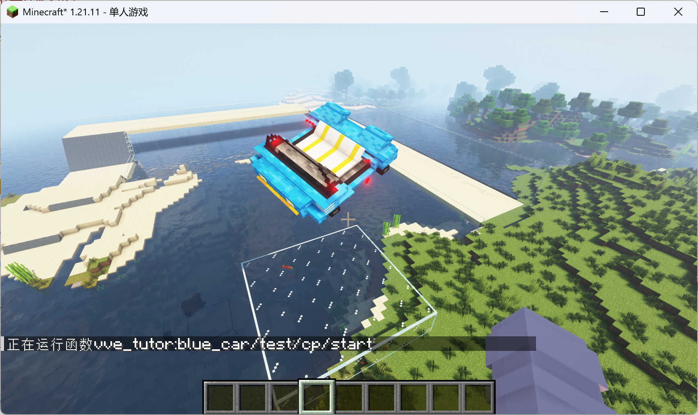

可以看到小车被压扁了。使用以下命令结束测试：

```
scoreboard players set test int 1
```

打开 `_update_display` 函数，将第 5 行添加注释不执行，关闭模型缩放：

```mcfunction
#function vve:box_object/_update_display
```

打开 `test/cp/start` 函数，将第 41 行添加注释不执行，关闭物体旋转：

```mcfunction
#execute as @e[tag=result,limit=1] at @s positioned ~5.0 ~5.0 ~5.0 run function vve:object/_rotate_here_as
```

回到游戏重新运行测试：

```
reload
function vve_tutor:blue_car/test/cp/start
```

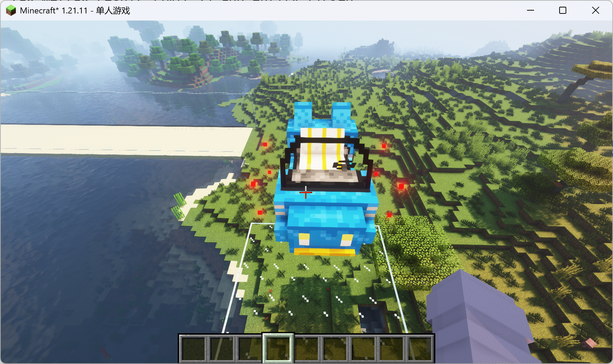

观察到小车旁边有八个红色的粒子，它们标识的是物理模型的碰撞点。我们需要调整物体的显示模型，使其与实际的红色碰撞点对齐。

由于笔者建模时选择了 X 轴作为前后方向，没有与红色碰撞点前后方向一致，这里为 `_update_display` 函数添加一个四元数设置，旋转模型：

```mcfunction
#vve_tutor:blue_car/_update_display
# 更新展示设置
# 传入blue_car实例为执行者

data modify entity @s transformation.right_rotation set value [0.0f,0.7071f,0.0f,0.7071f]
#function vve:box_object/_update_display
```

回到游戏重新加载，重新运行测试：

```
scoreboard players set test int 1
reload
function vve_tutor:blue_car/test/cp/start
```

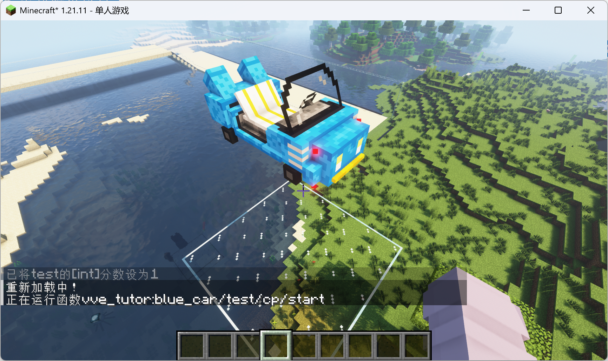

观察到车身与碰撞点前后方向一致。可以打开 F3 查看朝向：

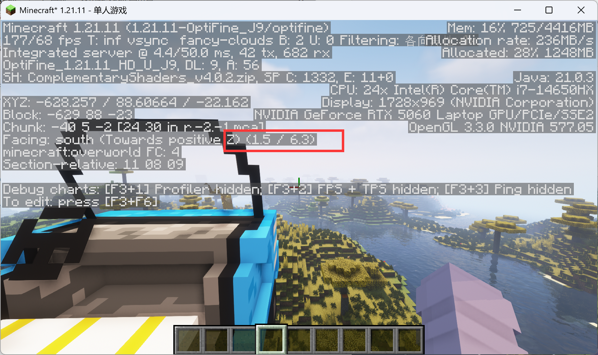

如果设置正确，那么车头应该为 `(0.0, 0.0)` 朝向。

继续打开模块下的 `_class` 函数，调整物理模型尺寸，使得红色碰撞点与车轮底部对齐。

笔者将第 6 到 10 行修改为以下内容：

```mcfunction
# 车身尺寸
scoreboard players set scale_u int 11500
scoreboard players set scale_v int 7000
scoreboard players set scale_w int 18000
function vve:cubox/_calc_shift
```

其中：
- `scale_u` 代表物理模型在**左右方向**的缩放，倍率为 `10000`（例如 `11500` 代表缩放 1.15 倍）
- `scale_v` 代表**上下方向**的缩放
- `scale_w` 代表**前后方向**的缩放

`_class` 函数中包含对载具各项参数的设置，这里调整一下发动机的运行功率和最大速度。

将第 17 到 26 行修改为以下内容：

```mcfunction
# 前进/后退功率
scoreboard players set forward_power int 20000
scoreboard players set backward_power int -10000
# 发动机参数
scoreboard players set target_power int 0
scoreboard players set damp_x int 0
scoreboard players set damp_k int 17
scoreboard players set damp_b int 20
scoreboard players set damp_f int 1000
scoreboard players set v_max int 3000
```

回到游戏重新加载和运行测试：

```
scoreboard players set test int 1
reload
function vve_tutor:blue_car/test/cp/start
```

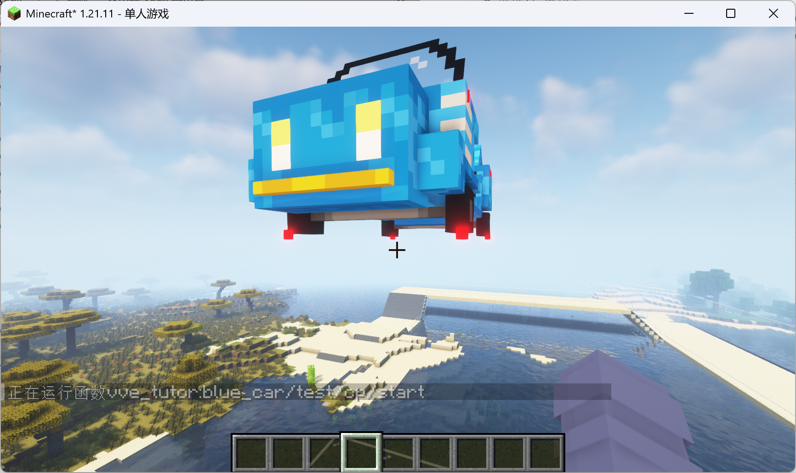

碰撞点大致对齐到车轮底部即可，如果没有对齐请反复调整。

打开 `test/fall/start`，取消落地测试的旋转。将第 40 行添加注释：

```mcfunction
#execute as @e[tag=result,limit=1] at @s positioned ~5.0 ~5.0 ~5.0 run function vve:object/_rotate_here_as
```

接下来可以结束显示测试，运行落地测试，观察物理效果是否正确：

```
scoreboard players set test int 1
reload
function vve_tutor:blue_car/test/fall/start
```

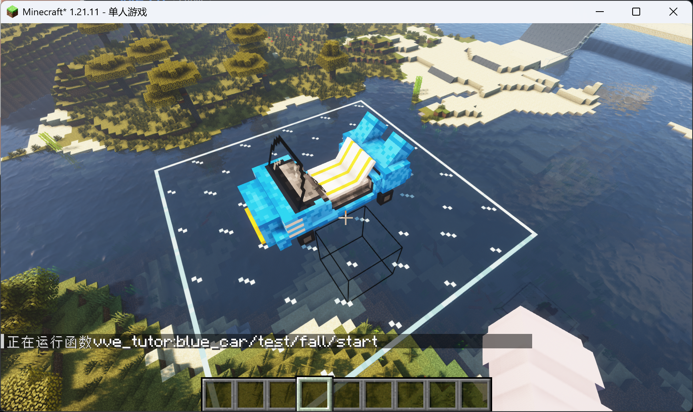

载具落地后稳定。

接下来调整座椅高度：

```mcfunction
execute as @n[tag=test] on passengers run ride @p mount @s
```

根据玩家乘坐位置，在 `set_operation` 函数中调整座椅参数。这里将座椅高度调整为 `1000`（0.1 格）。

修改 `set_operation` 函数第 12 行：

```mcfunction
scoreboard players set height int 1000
```

结束落地测试：

```
reload
scoreboard players set test int 1
```

---

## 六、搭建模拟器

可以将物理小车投放到实际的场地了。请搭建**开阔平坦的跑道场地**，而不是原版地形（载具很容易翻跟头）。

推荐跑道宽度：**16**，周围有玻璃护栏（L 形，最底部也需要和跑道连接）。

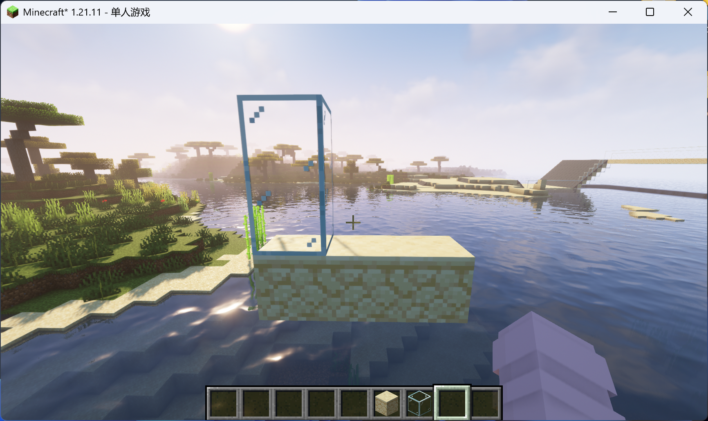

如果您安装了 VVE3 资源包，可以使用白桦木活板门搭建斜坡。

来到 `function` 目录，新建一个 `simulator` 文件夹作为模拟器模块（可自定义名称）。

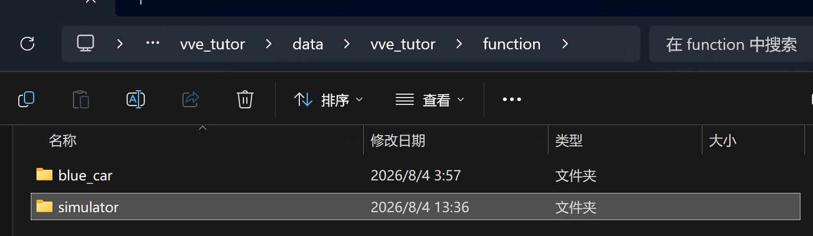

进入 `simulator` 模块，`Shift`+右键打开powershell或终端 运行 MOT，推送模拟器模板：

```
push vve_simulator_1.0
```

开始构建模块：

```
mcfo
run
init
sync
stop
pop
```

结束运行记忆栈：

```
stop
```

打开 `_class` 函数，修改模拟器参数。修改第 5 行，将模拟速率调整为 2：

```mcfunction
scoreboard players set global_rate int 2
```

打开 `_class` 函数，为模拟器设置以下常量：

```mcfunction
#vve_tutor:simulator/_consts
# 创建常量

# 加载预设常量
function vve:_consts

# 手动设置常量
scoreboard players set vve_grab_friction int 9800
scoreboard players set vve_solid_friction int 9800
scoreboard players set vve_grab_friction_tan int 9800
scoreboard players set vve_solid_friction_tan int 9800
# 使用函数y=1/(x+1)对比例x进行映射后得到的值
scoreboard players set vve_solid_bounce_inv int 6896
```

打开 `main_loop` 函数，调度小车主程序。将第 8 行修改为：

```mcfunction
execute as @e[tag=vve_tutor_blue_car] run function vve_tutor:blue_car/main_c
```

回到游戏重新加载：

```
reload
```

初始化模拟器：

```
function vve_tutor:simulator/init
```

启动模拟器：

```
function vve_tutor:simulator/_start
```

生成小车测试：

```
function vve_tutor:blue_car/_summon_here
```

骑乘小车：

```
function vve_tutor:blue_car/_ride_on_nearest
```

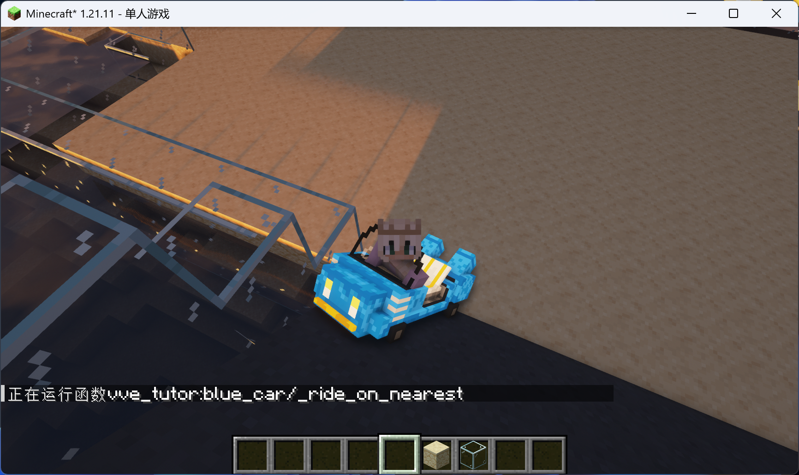

已经可以驾驶了。

删除小车：

```
function vve_tutor:blue_car/_del_nearest
```

---

## 七、载具控制

模板已经写好了一套简易的控制程序，我们添加方向盘转动车轮的模型动画即可。

打开 `blue_car/.doc.mcfo`，修改对象格式，增加一个字段用于记录轮胎状态。

开头追加一个 `wheel_state` 字段，其余字段保持不变（省略号代表其余字段）：

```mcfo
#vve_tutor:blue_car/doc.mcfo

# blue_car临时对象
_this:{
    wheel_state:<wheel_state,int,1>,
    ...
}
```

在 `blue_car` 文件夹下按 `Shift`+右键 重新运行 MOT。

首先推送标准数据接口模板：

```
push std_mem
```

然后运行以下命令，刷新数据接口：

```
run
unprotect_data
sync
stop
pop
```

结束 MOT 运行：

```
stop
```

打开 `blue_car/control/main_surface` 函数，在下文追加以下代码（上文代码保持不变，省略号代表其余代码）：

```mcfunction
...

# 同步轮胎状态
scoreboard players set wheel_state int 0
execute if score input_a int matches 1 run scoreboard players set wheel_state int 1
execute if score input_d int matches 1 run scoreboard players set wheel_state int 2
execute unless score wheel_state int = @s wheel_state store result entity @s item.components."minecraft:custom_model_data".floats[0] float 1 run scoreboard players get wheel_state int
```

回到游戏重新加载：

```
reload
```

重新初始化载具模块：

```
function vve_tutor:blue_car/init
```

生成载具：

```
function vve_tutor:blue_car/_summon_here
```

骑乘载具：

```
function vve_tutor:blue_car/_ride_on_nearest
```

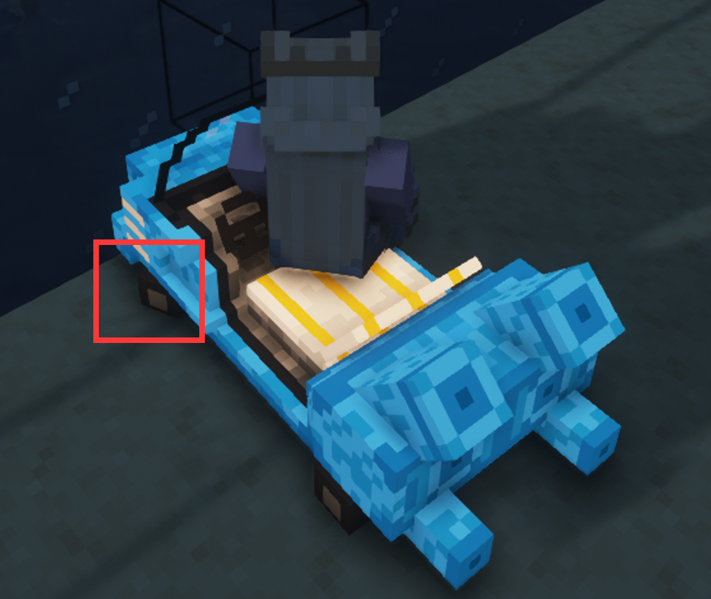

观察到轮胎转向正常。

删除载具：

```
function vve_tutor:blue_car/_del_nearest
```

---

## 八、声音程序

直接调用 VVE 示例仓库 `vve_examples:green_car` 的声音程序。

打开 `blue_car/main_c` 函数，从第 36 行开始（即坐标安全的代码之前），追加以下代码：

```mcfunction
# 声音程序
function vve:sound/_get
execute at @s positioned ~ ~0.5 ~ as 0-0-0-0-0 run function vve_examples:green_car/sound/main
function vve:sound/_store
```

---

## 九、撞击伤害机制

为载具追加伤害机制。

打开 `main_c` 函数，在声音程序代码后面追加以下代码：

```mcfunction
# 获取速度L无穷范数
scoreboard players operation temp_max int = vx int
execute if score temp_max int matches ..-1 run scoreboard players operation temp_max int *= -1 int
scoreboard players operation temp_abs int = vy int
execute if score temp_abs int matches ..-1 run scoreboard players operation temp_abs int *= -1 int
scoreboard players operation temp_max int > temp_abs int
scoreboard players operation temp_abs int = vz int
execute if score temp_abs int matches ..-1 run scoreboard players operation temp_abs int *= -1 int
scoreboard players operation temp_max int > temp_abs int
# 伤害程序
scoreboard players set u int 0
scoreboard players set v int 0
scoreboard players set w int 9000
execute if score temp_max int matches 500.. as 0-0-0-0-0 run function math:uvw/_topos
execute if score temp_max int matches 500.. as 0-0-0-0-0 at @s run function vve_tutor:blue_car/main_damage
```

创建 `blue_car/main_damage` 函数：

```mcfunction
#vve_tutor:blue_car/main_damage
# vve_tutor:blue_car/main_c调用

execute positioned ~-0.5 ~-0.5 ~-0.5 as @e[dx=0,dy=0,dz=0,type=!minecraft:player,tag=] run function vve_tutor:blue_car/damage

# 坐标安全
tp @s 0 0 0
```

创建 `blue_car/damage` 函数：

```mcfunction
#vve_tutor:blue_car/damage
# vve_tutor:blue_car/main_damage调用

damage @s 5 vve_tutor:damage
execute at @s anchored eyes positioned ^ ^-0.5 ^ run particle minecraft:block{block_state:{Name:"minecraft:redstone_block"}} ~ ~ ~ 0.0 0.0 0.0 0.2 15 force @a
```

回到命名空间 `vve_tutor`，创建 `damage_type` 文件夹，在 `damage_type` 文件夹下创建一个新的伤害类型 `damage.json`：

```json
{
    "exhaustion": 1.0,
    "message_id": "msgId",
    "scaling": "never"
}
```

回到 `data` 文件夹，创建新的命名空间 `minecraft`，创建 `minecraft/tags/damage_type/bypasses_cooldown.json`：

```json
{
    "replace": false,
    "values": [
        "vve_tutor:damage"
    ]
}
```

> **注意**：由于伤害类型是实验性设置，我们需要**退出存档重新进入**。

生成载具并骑乘：

```
function vve_tutor:blue_car/_summon_here
function vve_tutor:blue_car/_ride_on_nearest
```

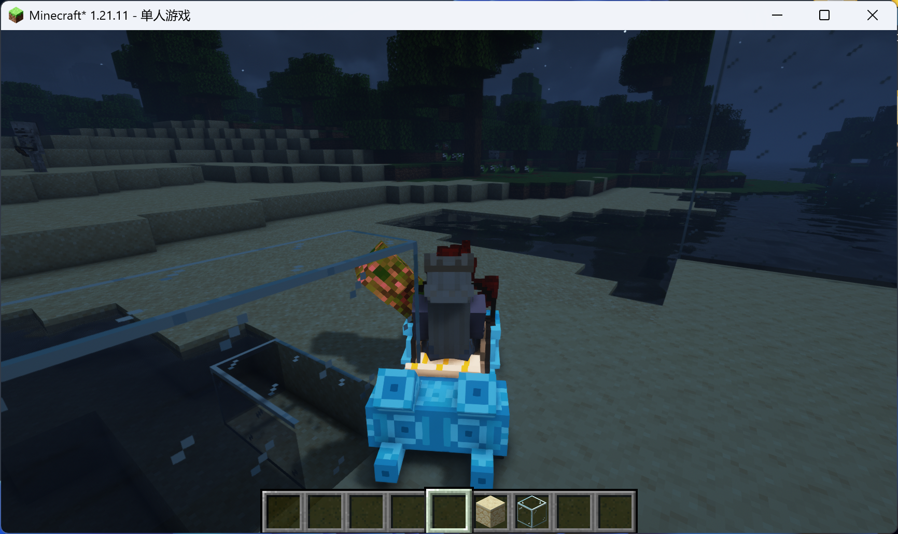

现在载具撞击生物会造成伤害。

删除载具命令：

```
function vve_tutor:blue_car/_del_nearest
```