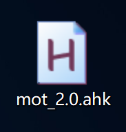
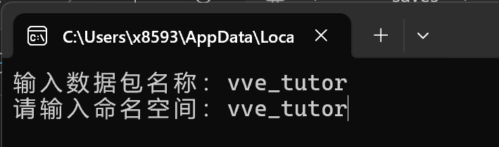
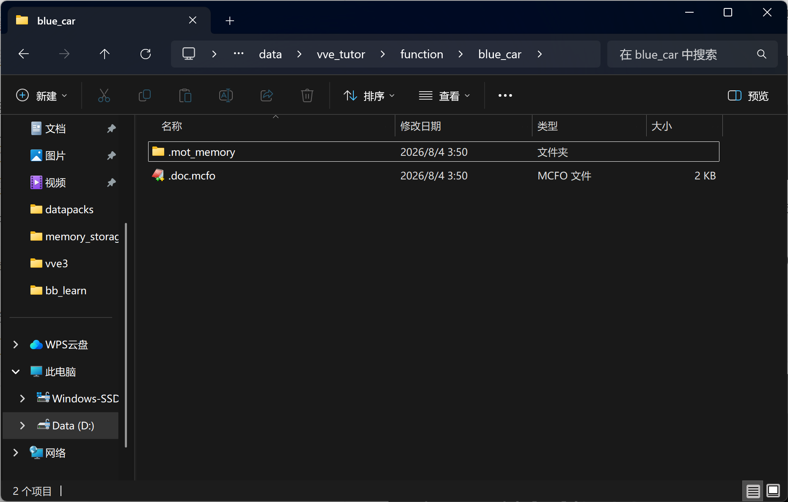
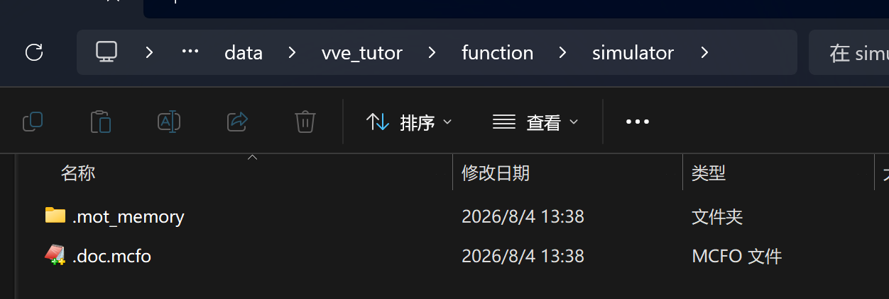

# VVE3引擎教程——自定义小车

适用版本：1.21.5~26.2

## 下载依赖

vve本体3.0.2: https://github.com/xiaodou8593/vve3.0

vve3资源包：https://github.com/xiaodou8593/vve3.0_rp

数学库3.1.3: https://github.com/xiaodou8593/math3.1

线性代数库3.1.3: https://github.com/xiaodou8593/math3.1_lalib

图形库3.1.3: https://github.com/xiaodou8593/math3.1_gelib

模块构建器mot2.0.1: https://github.com/xiaodou8593/mot_2.0

其中mot需要python和autohotkey的运行环境，如果您的系统里没有，可以使用仓库内的安装包进行安装。

双击运行mot2.0.ahk，系统右下角托盘出现绿色H图标表明mot已运行。




## 制作小车模型

使用3D建模软件，如BlockBench制作小车的模型。


建模有以下几点需要注意：

1. 需要制作三份模型，分别用于前进状态、方向盘左转状态、方向盘右转状态
2. 模型的质心位置需要与中心对齐，如果后续在游戏中发现中心没对齐，需要偏移，也可以在显示调整->物品展示框中调整位置

资源包制作教程本文略，可参考：

https://zh.minecraft.wiki/w/Tutorial:%E5%88%B6%E4%BD%9C%E8%B5%84%E6%BA%90%E5%8C%85

【【复刻计划】爆肝3000字！阿乔也能看懂的物品模型映射教程（MC1.21.4）】 https://www.bilibili.com/video/BV1w5FEejEra/

在新版本资源包中，您需要为物品模型创建一个物品模型映射，可以参考教程示例数据包`model_practice/assets/xiaodou123/items/blue_car.json`的写法：

```json
{
    "model": {
        "type": "range_dispatch",
        "entries": [
		{"threshold":0.0,"model":{"type":"model","model":"xiaodou123:blue_car"}},
		{"threshold":1.0,"model":{"type":"model","model":"xiaodou123:blue_car_left"}},
		{"threshold":2.0,"model":{"type":"model","model":"xiaodou123:blue_car_right"}}
	],
	"property":"custom_model_data"
    }

}
```

使用`custom_model_data`索引三个不同状态的模型，0.0对应前进状态，1.0对应左转方向盘状态，2.0对应右转方向盘状态。

## 安装数据包

将vve3, math3, math3线性代数库, math3图形库放入存档datapacks文件夹下。

在mc游戏中进入存档，聊天栏输入命令`/reload`

然后初始化各个数据包

```
function math:_init
function math:_init_la
function math:_init_ge
function math:particles/_load_1214
function vve:_init
```

寻找一个空旷的位置作为vve测试坐标

```
function vve:test_coord/_set_here_align
```

## 构建模块

我们在存档的datapacks文件夹下创建一个新数据包，本文使用的包名和命名空间均为vve_tutor，您也可以使用自定义名称。

可以在datapacks文件夹窗口下，也可以使用mot快捷键ctrl+p快捷创建数据包，输入包名和命名空间即可。



我们在新建好的数据包function文件夹内，新建一个文件夹blue_car（可以自定义名称），这个文件夹被我们称之为一个模块。

在blue_car文件夹窗口下，我们使用mot快捷键ctrl+m运行记忆栈（终端窗口）

推送vve_vehicle_lite_1.0模板

```
push vve_vehicle_lite_1.0
```


然后我们回到文件夹窗口，使用mot快捷键ctrl+o创建对象格式文档（**请注意本步骤一定要在推送模板之后，下文的构建模块之前**）



回到mot记忆栈，依次输入以下命令构建模块

```
run
init
sync
stop
pop
```


可以检查函数前缀是否相符，如果出现问题请参考[mot2.0仓库](https://github.com/xiaodou8593/mot_2.0)内的注意事项

接下来我们继续在mot记忆栈内为blue_car模块构建自动测试

首先推送自动测试模板vve_test_1.0

```
push vve_test_1.0
```

然后像刚才那样构建模块

```
run
init
sync
stop
pop
```

最后结束mot记忆栈运行

```
stop
```

## 模型对齐

我们打开模块下的set_operation函数，将物体的模型引用制作的小车模型

第8行修改为：

```
item replace entity @s container.0 with minecraft:clay_ball[minecraft:item_model="xiaodou123:blue_car",minecraft:custom_model_data={floats:[0.0f]}]
```

其中minecraft:item_model=""内部应填写您的物品模型映射路径

我们进入游戏，重新加载数据包，并启动显示测试

```
reload
function vve_tutor:blue_car/test/cp/start
```


可以看到小车被压扁了

我们使用以下命令结束测试

```
scoreboard players set test int 1
```

我们打开_update_display函数，将第5行添加注释不执行，关闭模型缩放

```
#function vve:box_object/_update_display
```

我们打开test/cp/start函数，将第41行添加注释不执行，关闭物体旋转

```
#execute as @e[tag=result,limit=1] at @s positioned ~5.0 ~5.0 ~5.0 run function vve:object/_rotate_here_as
```

回到游戏重新运行测试

```
reload
function vve_tutor:blue_car/test/cp/start
```


观察到小车旁边有八个红色的粒子，它们标识的是物理模型的碰撞点

我们需要调整物体的显示模型，使其与实际的红色碰撞点对齐。

由于笔者建模时选择了x轴作为前后方向，没有与红色碰撞点前后方向一致，这里为_update_display函数添加一个四元数设置，旋转模型

```
#vve_tutor:blue_car/_update_display
# 更新展示设置
# 传入blue_car实例为执行者

data modify entity @s transformation.right_rotation set value [0.0f,0.7071f,0.0f,0.7071f]
#function vve:box_object/_update_display
```

回到游戏重新加载，重新运行测试

```
scoreboard players set test int 1
reload
function vve_tutor:blue_car/test/cp/start
```


观察到车身与碰撞点前后方向一致。

我们可以打开F3查看朝向


如果设置正确，那么车头应该为(0.0,0.0)朝向

我们继续打开模块下的_class函数，调整物理模型尺寸，使得红色碰撞点与车轮底部对齐

笔者将6到10行修改为以下内容

```
# 车身尺寸
scoreboard players set scale_u int 11500
scoreboard players set scale_v int 7000
scoreboard players set scale_w int 18000
function vve:cubox/_calc_shift
```

其中scale_u代表物理模型在左右方向的缩放，倍率为10000（例如11500代表缩放1.15倍），scale_v代表上下方向的缩放，scale_w代表前后方向的缩放。

_class函数中包含对载具各项参数的设置，我们这里调整一下发动机的运行功率和最大速度

将17到26行修改为以下内容

```
# 前进/后退功率
scoreboard players set forward_power int 20000
scoreboard players set backward_power int -10000
# 发动机参数
scoreboard players set target_power int 0
scoreboard players set damp_x int 0
scoreboard players set damp_k int 17
scoreboard players set damp_b int 20
scoreboard players set damp_f int 1000
scoreboard players set v_max int 3000
```

回到游戏重新加载和运行测试

```
scoreboard players set test int 1
reload
function vve_tutor:blue_car/test/cp/start
```


碰撞点大致对齐到车轮底部即可，如果没有对齐请反复调整。

我们打开test/fall/start，取消落地测试的旋转

将第40行添加注释：

```
#execute as @e[tag=result,limit=1] at @s positioned ~5.0 ~5.0 ~5.0 run function vve:object/_rotate_here_as
```

接下来我们可以结束显示测试，运行落地测试，观察物理效果是否正确

```
scoreboard players set test int 1
reload
function vve_tutor:blue_car/test/fall/start
```


载具落地后稳定

接下来我们调整座椅高度

```
execute as @n[tag=test] on passengers run ride @p mount @s
```

根据玩家乘坐位置，在set_operation函数中调整座椅参数

我们这里将座椅高度调整为1000（0.1格）

修改set_operation函数第12行：
```
scoreboard players set height int 1000
```

结束落地测试

```
reload
scoreboard players set test int 1
```

## 搭建模拟器

我们可以将物理小车投放到实际的场地了。请搭建开阔平坦的跑道场地，而不是原版地形（载具很容易翻跟头）。

推荐跑道宽度：16，周围有玻璃护栏（L形，最底部也需要和跑道连接）


如果您安装了vve3资源包，可以使用白桦木活板门搭建斜坡

来到function目录，我们新建一个simulator文件夹作为模拟器模块（也可以自定义名称）


进入simulator模块，ctrl+m运行mot记忆栈，推送模拟器模板

```
push vve_simulator_1.0
```

回到文件夹目录，ctrl+o创建对象格式文档



回到mot记忆栈开始构建模块

```
run
init
sync
stop
pop
```

结束运行记忆栈

```
stop
```

我们打开_class函数，修改模拟器参数

修改第5行，将模拟速率调整为2

```
scoreboard players set global_rate int 2
```

打开_class函数，为模拟器设置以下常量

```
#vve_tutor:simulator/_consts
# 创建常量

# 加载预设常量
function vve:_consts

# 手动设置常量
scoreboard players set vve_grab_friction int 9800
scoreboard players set vve_solid_friction int 9800
scoreboard players set vve_grab_friction_tan int 9800
scoreboard players set vve_solid_friction_tan int 9800
# 使用函数y=1/(x+1)对比例x进行映射后得到的值
scoreboard players set vve_solid_bounce_inv int 6896
```

打开main_loop函数，调度小车主程序

将第8行修改为：

```
execute as @e[tag=vve_tutor_blue_car] run function vve_tutor:blue_car/main_c
```

回到游戏重新加载

```
reload
```

初始化模拟器

```
function vve_tutor:simulator/init
```

启动模拟器

```
function vve_tutor:simulator/_start
```

生成小车测试

```
function vve_tutor:blue_car/_summon_here
```

骑乘小车

```
function vve_tutor:blue_car/_ride_on_nearest
```


已经可以驾驶了。

删除小车

```
function vve_tutor:blue_car/_del_nearest
```

## 载具控制

模板已经写好了一套简易的控制程序，我们添加方向盘转动车轮的模型动画即可

打开blue_car/.doc.mcfo，我们修改对象格式，增加一个字段用于记录轮胎状态

开头追加一个wheel_state字段，其余字段保持不变（省略号代表其余字段）

```
#vve_tutor:blue_car/doc.mcfo

# blue_car临时对象
_this:{
	wheel_state:<wheel_state,int,1>,
	...
}
```

在blue_car文件夹下按ctrl+m重新运行mot记忆栈

首先推送标准数据接口模板

```
push std_mem
```

然后运行以下命令，刷新数据接口

```
run
unprotect_data
sync
stop
pop
```

结束mot记忆栈运行

```
stop
```

打开blue_car/control/main_surface函数

在下文追加以下代码，上文代码保持不变（省略号代表其余代码）

```
...

# 同步轮胎状态
scoreboard players set wheel_state int 0
execute if score input_a int matches 1 run scoreboard players set wheel_state int 1
execute if score input_d int matches 1 run scoreboard players set wheel_state int 2
execute unless score wheel_state int = @s wheel_state store result entity @s item.components."minecraft:custom_model_data".floats[0] float 1 run scoreboard players get wheel_state int
```

回到游戏重新加载

```
reload
```

重新初始化载具模块

```
function vve_tutor:blue_car/init
```

生成载具

```
function vve_tutor:blue_car/_summon_here
```

骑乘载具

```
function vve_tutor:blue_car/_ride_on_nearest
```


观察到轮胎转向正常

删除载具

```
function vve_tutor:blue_car/_del_nearest
```

## 声音程序

我们直接调用vve示例仓库vve_examples:green_car的声音程序

打开blue_car/main_c函数，从第36行开始（即坐标安全的代码之前），追加以下代码

```
# 声音程序
function vve:sound/_get
execute at @s positioned ~ ~0.5 ~ as 0-0-0-0-0 run function vve_examples:green_car/sound/main
function vve:sound/_store
```

## 撞击伤害机制

为载具追加伤害机制

打开main_c函数，在声音程序代码后面追加以下代码

```
# 获取速度L无穷范数
scoreboard players operation temp_max int = vx int
execute if score temp_max int matches ..-1 run scoreboard players operation temp_max int *= -1 int
scoreboard players operation temp_abs int = vy int
execute if score temp_abs int matches ..-1 run scoreboard players operation temp_abs int *= -1 int
scoreboard players operation temp_max int > temp_abs int
scoreboard players operation temp_abs int = vz int
execute if score temp_abs int matches ..-1 run scoreboard players operation temp_abs int *= -1 int
scoreboard players operation temp_max int > temp_abs int
# 伤害程序
scoreboard players set u int 0
scoreboard players set v int 0
scoreboard players set w int 9000
execute if score temp_max int matches 500.. as 0-0-0-0-0 run function math:uvw/_topos
execute if score temp_max int matches 500.. as 0-0-0-0-0 at @s run function vve_tutor:blue_car/main_damage
```

创建blue_car/main_damage函数

```
#vve_tutor:blue_car/main_damage
# vve_tutor:blue_car/main_c调用

execute positioned ~-0.5 ~-0.5 ~-0.5 as @e[dx=0,dy=0,dz=0,type=!minecraft:player,tag=] run function vve_tutor:blue_car/damage

# 坐标安全
tp @s 0 0 0
```

创建blue_car/damage函数

```
#vve_tutor:blue_car/damage
# vve_tutor:blue_car/main_damage调用

damage @s 5 vve_tutor:damage
execute at @s anchored eyes positioned ^ ^-0.5 ^ run particle minecraft:block{block_state:{Name:"minecraft:redstone_block"}} ~ ~ ~ 0.0 0.0 0.0 0.2 15 force @a
```

回到命名空间vve_tutor，创建damage_type文件夹，在damage_type文件夹下创建一个新的伤害类型damage.json

```
{
	"exhaustion":1.0,
	"message_id":"msgId",
	"scaling":"never"
}
```

回到data文件夹，创建新的命名空间minecraft，创建`minecraft/tags/damage_type/bypasses_cooldown.json`

```
{
	"replace":false,
	"values":[
		"vve_tutor:damage"
	]
}
```

由于伤害类型是实验性设置，我们需要退出存档重新进入

生成载具并骑乘

```
function vve_tutor:blue_car/_summon_here
function vve_tutor:blue_car/_ride_on_nearest
```


现在载具撞击生物会造成伤害

删除载具命令

```
function vve_tutor:blue_car/_del_nearest
```