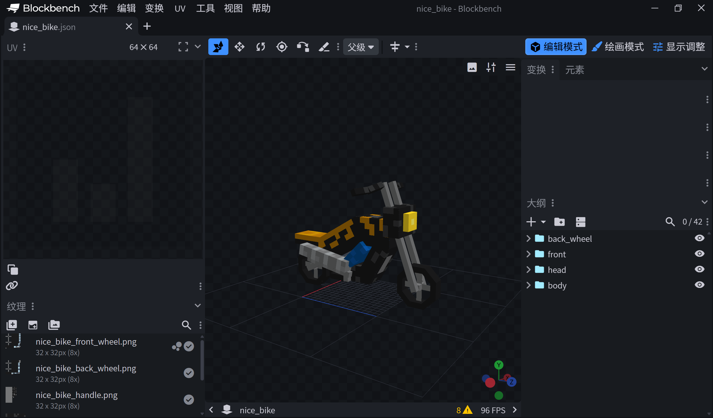
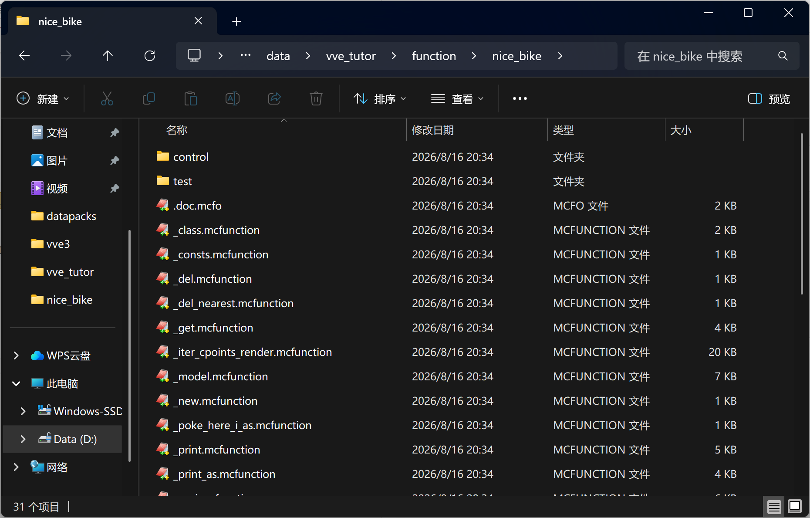
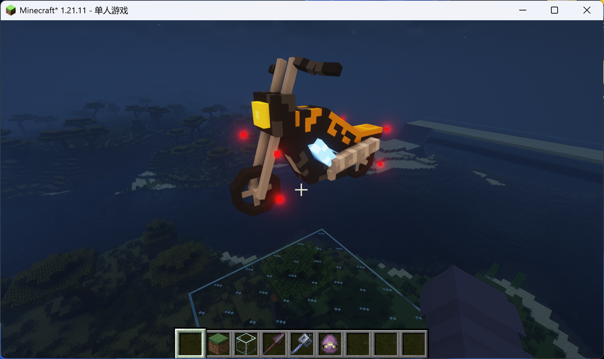
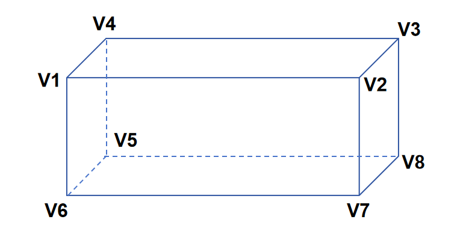
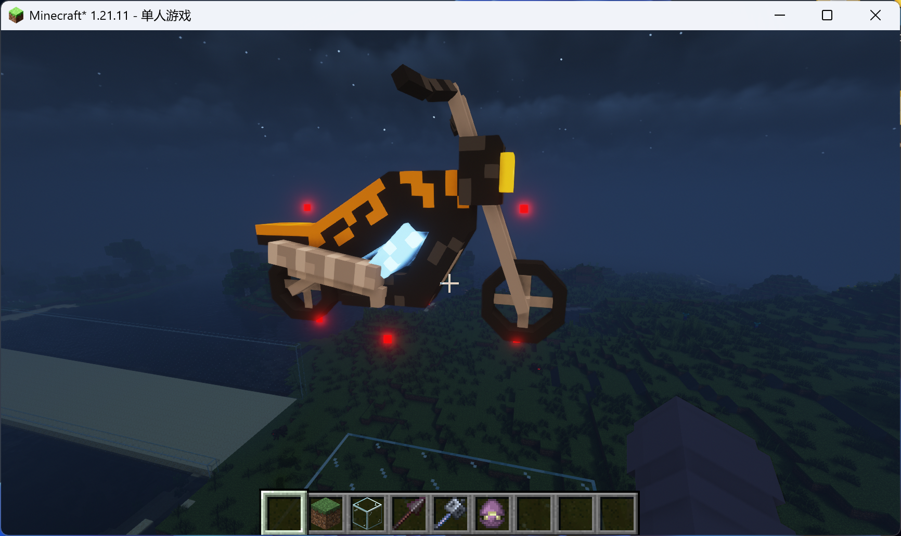
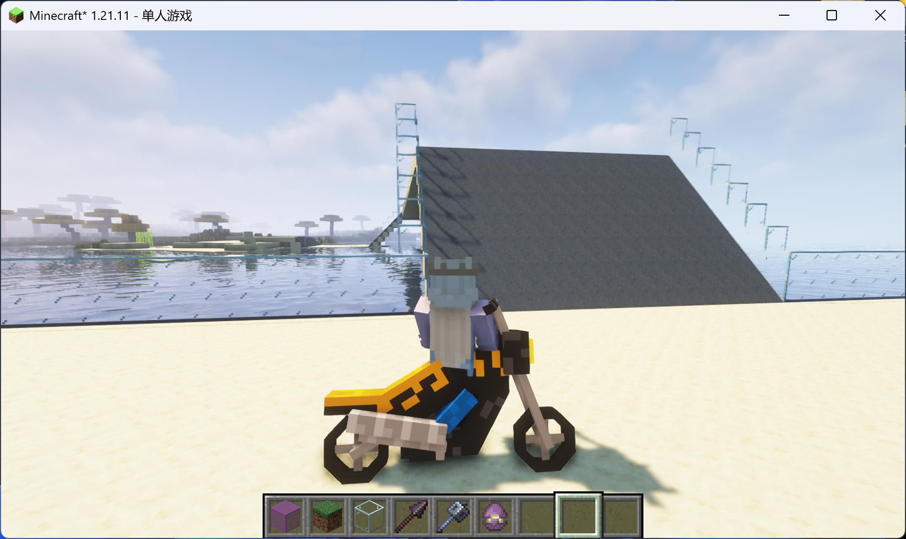

# VVE3 引擎教程——制作摩托车

> 本篇教程预设：您已经完成VVE引擎教程第一节：自定义物理小车中的依赖下载、安装、基础模块搭建。**本篇教程难度较大**，不懂的地方可以先抄代码，有时间再慢慢研究原理。

**适用版本：1.21.5 ~ 26.2**

## 一、制作摩托车模型



模型制作六份，添加以下物品模型映射：

* `0`映射为前进状态，轮胎旋转`0`度
* `1`映射为前进状态，轮胎旋转`45`度
* `2`映射为左脚撑打开状态，轮胎旋转`0`度
* `3`映射为左脚撑打开状态，轮胎旋转`45`度
* `4`映射为右脚撑打开状态，轮胎旋转`0`度
* `5`映射为右脚撑打开状态，轮胎旋转`45`度

```json
{
    "model": {
        "type": "range_dispatch",
        "entries": [
		{"threshold":0.0,"model":{"type":"model","model":"xiaodou123:nice_bike/nice_bike"}},
		{"threshold":1.0,"model":{"type":"model","model":"xiaodou123:nice_bike/nice_bike_45"}},
		{"threshold":2.0,"model":{"type":"model","model":"xiaodou123:nice_bike/nice_bike_q"}},
		{"threshold":3.0,"model":{"type":"model","model":"xiaodou123:nice_bike/nice_bike_q_45"}},
		{"threshold":4.0,"model":{"type":"model","model":"xiaodou123:nice_bike/nice_bike_e"}},
		{"threshold":5.0,"model":{"type":"model","model":"xiaodou123:nice_bike/nice_bike_e_45"}}
	],
	"property":"custom_model_data"
    }

}
```

## 二、构建模块

双击运行mot2.0.ahk文件

在第一节教程的vve_tutor命名空间function文件夹下，我们新建nice_bike模块。

在nice_bike模块内按ctrl+m运行mot记忆栈，推送载具模板

```
push vve_vehicle_lite_1.0
```

回到模块目录按ctrl+o创建对象格式文档

回到记忆栈继续运行命令

```
run
init
sync
stop
pop
```

推送自动测试模板

```
push vve_test_1.0
run
init
sync
stop
pop
stop
```



## 二、模型对齐

打开模块下的 `set_operation` 函数，将物体的模型引用制作的摩托车模型。

第 8 行修改为：

```mcfunction
item replace entity @s container.0 with minecraft:clay_ball[minecraft:item_model="xiaodou123:nice_bike",minecraft:custom_model_data={floats:[0.0f]}]
```

其中 `minecraft:item_model=""` 内部应填写您的物品模型映射路径。

修改第12行座椅高度

```mcfunction
...
# 设置座椅宽高（高度调整玩家位置）
scoreboard players set width int 10000
scoreboard players set height int 4000
execute on passengers run function vve:seat/_prescript
...
```

打开`_update_display`函数，调整模型显示

```mcfunction
#vve_tutor:nice_bike/_update_display
# 更新展示设置
# 传入nice_bike实例为执行者

data modify entity @s transformation.right_rotation set value [0.0f,1.0f,0.0f,0.0f]
data modify entity @s transformation.scale set value [1.5f,1.5f,1.5f]
#function vve:box_object/_update_display
```

打开`test/cp/start`，最后一行加注释取消旋转

```
#execute as @e[tag=result,limit=1] at @s positioned ~5.0 ~5.0 ~5.0 run function vve:object/_rotate_here_as
```

进入游戏，重新加载数据包，并启动显示测试：

```
reload
function vve_tutor:blue_car/test/cp/start
```



车头朝向正南

运行以下命令，检查座椅高度

```
execute as @n[tag=test] on passengers run ride @p mount @s
```

结束测试

```
scoreboard players set test int 1
```

## 三、设计物理碰撞点

我们本节教程的重点，是理解`_iter_cpoints_*`系列函数的代码。

首先，固定UUID为0-0-0-0-0的marker实体（通常被称为世界实体），会作为执行者被传入`_iter_cpoints_*`系列函数

`_iter_cpoints_*`系列函数的职责是：
1. 遍历当前物体每一个顶点的位置和速度
2. 在每个顶点调用`_detect_*`系列函数进行介质探测
3. 接收并汇总每一个顶点的介质响应，作为整个物体收到的介质响应。

以下是`vve:cpoint/.doc.mcfo`对一个碰撞点的定义：

```
#vve:cpoint/doc.mcfo

# cpoint临时对象
_this:{
	center:{
		<c_x,int,1w>, <c_y,int,1w>, <c_z,int,1w>
	},
	velocity:{
		<c_vx,int,1w>, <c_vy,int,1w>, <c_vz,int,1w>
	},
	mass:<c_mass,int>
}
```

一个碰撞点需要包含：

* 三维向量`center`作为它的位置
* 三维向量`velocity`作为它的速度
* 整数`c_mass`作为它的等效质量

其中，等效质量一般取物体本身的质量。

以`_iter_cpoints_render`中顶点8的代码为例

```mcfunction
# 顶点8介质探测
scoreboard players operation c_vx int += sstemp_tx int
scoreboard players operation c_vy int += sstemp_ty int
scoreboard players operation c_vz int += sstemp_tz int
execute store result storage math:io xyz[0] double 0.0001 run scoreboard players operation c_x int += sstemp_kx int
execute store result storage math:io xyz[1] double 0.0001 run scoreboard players operation c_y int += sstemp_ky int
execute store result storage math:io xyz[2] double 0.0001 run scoreboard players operation c_z int += sstemp_kz int
#tellraw @a ["vertex 8: ", {"nbt":"xyz","storage":"math:io"}]
data modify entity @s Pos set from storage math:io xyz
execute at @s run function vve:_detect_render
execute if score bounce_layer_response int matches 1 run function vve:object/_receive_bounce_layer
execute if score grab_layer_response int matches 1 run function vve:object/_receive_grab_layer
scoreboard players operation friction_receiver_response int < friction_response int
execute if score shift_response int matches 1 run function vve:vehicle/_receive_shift
execute if score shift_response int matches 0 run function vve:vehicle/_receive_not_shift
execute if score impulse_response int matches 1 run function vve:object/_dec_impulse
scoreboard players operation surface int > surface_response int
```

可以看到，在调用函数`vve:_detect_render`之前，这里不仅输入了`center{<c_x,int,1w>,<c_y,int,1w>,<c_z,int,1w>}`、`velocity{<c_vx,int,1w>,<c_vy,int,1w>,<c_vz,int,1w>}`，还将`center`存入了`storage math:io xyz`，然后设置了世界实体的位置。这是因为：`_detect_*`系列函数还要求将碰撞点位置作为执行位置传入。

那么，编写一个`_iter_cpoints_*`函数最重要的问题，就是如何使用最少的命令，遍历所有的顶点，得到每个顶点的位置和速度。

已知：
* 刚体平动速度$\mathbf{v}_{trans}$
* 刚体旋转角速度$\boldsymbol{\omega}$

则碰撞点相对位置$\mathbf{r}$与速度$\mathbf{v}_{linear}$满足：

$$
\mathbf{v}_{linear}-\mathbf{v}_{trans} = \boldsymbol{\omega} \times \mathbf{r}
$$

对于两个碰撞点 $V_1$、$V_2$，它们的位置矢量和速度矢量分别记为 
$(\mathbf{r}_1, \mathbf{v}_1)$、$(\mathbf{r}_2, \mathbf{v}_2)$

如果$\mathbf{r}_2 = k\,\mathbf{r}_1$，那么有：

$$
\begin{align*}
\mathbf{v}_2-\mathbf{v}_{trans} &= \boldsymbol{\omega} \times k\,\mathbf{r}_1 \\
&= k\,\boldsymbol{\omega} \times \mathbf{r}_1 \\
&= k(\mathbf{v}_1-\mathbf{v}_{trans})
\end{align*}
$$

对于三个碰撞点 $V_1$、$V_2$、$V_3$，它们的位置矢量和速度矢量分别记为 
$(\mathbf{r}_1, \mathbf{v}_1)$、$(\mathbf{r}_2, \mathbf{v}_2)$、$(\mathbf{r}_3, \mathbf{v}_3)$

如果$\mathbf{r}_3 = \mathbf{r}_1+\mathbf{r}_2$，那么有：

$$
\begin{align*}
\mathbf{v}_3-\mathbf{v}_{trans} &= \boldsymbol{\omega} \times (\mathbf{r}_1+\mathbf{r}_2) \\
&= \boldsymbol{\omega} \times \mathbf{r}_1 + \boldsymbol{\omega} \times \mathbf{r}_2 \\
&= (\mathbf{v}_1-\mathbf{v}_{trans}) + (\mathbf{v}_2-\mathbf{v}_{trans})
\end{align*}
$$

因此，如果我们将$\mathbf{v}_{linear}-\mathbf{v}_{trans}$和$\mathbf{r}$组成一个六维向量，我们只需要计算少量碰撞点作为标准基底，其它碰撞点的六维向量可以由标准基底线性组合得到。

以载具默认长方体的八个顶点`vve:vehicle/_iter_cpoints_c`的实现为例：



首先计算左上前三个方向的六维向量作为标准基底，把它们全部相加可以获得第一个碰撞点$V_1$

然后将三个标准基底乘以2，每次只需进行一次加减法就可以平移到下一个碰撞点，这样按照一笔画的顺序走完了$V_1$、$V_2$、$V_3$、$V_4$、$V_5$、$V_6$、$V_7$、$V_8$顶点，极大地节约了性能开销。

我们按照同样的思路，实现摩托车`_iter_cpoints_render`，遍历六个顶点

完整代码请参考[_iter_cpoints_render.mcfunction](../datapack/data/vve_tutor/function/nice_bike/_iter_cpoints_render.mcfunction)

我们修改_class函数，设置尺寸数据和功率等参数

```mcfunction
#vve_tutor:nice_bike/_class
# 生成预设静态数据模板

function vve_tutor:nice_bike/_zero
execute positioned 0.0 0.0 0.0 rotated 0.0 0.0 as 0-0-0-0-0 run function vve:object/_anchor_to
# 车身尺寸
scoreboard players set scale_u int 10000
scoreboard players set scale_v int 7500
scoreboard players set scale_w int 20000
function vve:cubox/_calc_shift
# 转弯半径
scoreboard players set rotation_r int 15000
# 质量和惯量
scoreboard players set mass int 50
scoreboard players set inp int 120
function vve:cubox/_calc_tensor_i
# 前进/后退功率
scoreboard players set forward_power int 20000
scoreboard players set backward_power int -16000
# 发动机参数
scoreboard players set target_power int 0
scoreboard players set damp_x int 0
scoreboard players set damp_k int 17
scoreboard players set damp_b int 20
scoreboard players set damp_f int 1000
scoreboard players set v_max int 2500
function vve_tutor:nice_bike/_model
data modify storage vve_tutor:class nice_bike_plate set from storage vve_tutor:io result
```

回到游戏重新运行测试

```
reload
function vve_tutor:nice_bike/test/cp/start
```



碰撞点与轮子底部对齐即可

结束测试

```
scoreboard players set test int 1
```

最后，摩托车脚撑位置的两个顶点，我们希望控制它的开关

打开.doc.mcfo，添加以下两个字段，分别控制脚撑开关和模型切换

```
#vve_tutor:nice_bike/doc.mcfo

# nice_bike临时对象
_this:{
	stand_state:<stand_state,int,1>,
	wheel_state:<wheel_state,int,1>,
	...
}
```

由于更新了对象字段，我们回到模块目录，按ctrl+m打开mot记忆栈

推送标准模板

```
push std_mem
```

刷新数据接口

```
run
unprotect_data
sync
stop
pop
```

结束记忆栈

```
stop
```

新建`_iter_cpoints_c`函数，实现摩托车自定义碰撞点逻辑

新建`iter_cpoints_7_8`函数，用于存放碰撞点$V_7$、$V_8$

完整实现参考:

* [_iter_cpoints_c.mcfunction](../datapack/data/vve_tutor/function/nice_bike/_iter_cpoints_c.mcfunction)

* [iter_cpoints_7_8.mcfunction](../datapack/data/vve_tutor/function/nice_bike/iter_cpoints_7_8.mcfunction)

我们在`_iter_cpoints_c`函数中还计算了摩托车当前的前进速度，输出为<temp_v,int,1w>

修改`main_c`函数第9行：

```
execute as 0-0-0-0-0 run function vve_tutor:nice_bike/_iter_cpoints_c
```

## 四、姿态修正算法

由于摩托车有水平、左右脚撑三种不同的着陆状态，我们需要为其实现特殊的姿态修正算法。

首先实现`_regular`函数，完整代码参照[_regular.mcfunction](../datapack/data/vve_tutor/function/nice_bike/_regular.mcfunction)

然后依次实现：

* `regular_2`函数，完整代码参照[regular_2.mcfunction](../datapack/data/vve_tutor/function/nice_bike/regular_2.mcfunction)
* `regular/surface_1`函数，完整代码参照[regular/surface_1.mcfunction](../datapack/data/vve_tutor/function/nice_bike/regular/surface_1.mcfunction)
* `regular/surface_2`函数，完整代码参照[regular/surface_2.mcfunction](../datapack/data/vve_tutor/function/nice_bike/regular/surface_2.mcfunction)

注意我们的实现，输出了<temp_surface,int>，便于后续控制脚撑模型切换

修改`main_c`函数，将第18行到24行部分的代码修改为以下：

```mcfunction
# 姿态角速度修正
tag @s[tag=vve_surface] remove vve_surface
execute if score shift_cnt int matches 1.. run tag @s add vve_surface
execute if score shift_cnt int matches 3.. run scoreboard players set surface int 1
scoreboard players set temp_surface int 0
execute if score surface int matches 1 as 0-0-0-0-0 run function vve_tutor:nice_bike/_regular
function vve:object/_apply_friction
```

## 五、姿态控制程序

摩托车在行驶过程中可以压弯，然后可以回正，这需要用到姿态控制程序。

我们打开`.doc.mcfo`，为对象内置姿态控制器的字段：

```
#vve_tutor:nice_bike/doc.mcfo

# nice_bike临时对象
_this:{
	stand_state:<stand_state,int,1>,
	wheel_state:<wheel_state,int,1>,
	eluer_control:{
		control_active:<control_active,int>,
		damp_params:{
			<vve_euler_k,int>,
			<vve_euler_b,int>,
			<vve_euler_f,int>,
			<vve_euler_max,int>,
			<vve_euler_vmax,int>
		},
		target_euler:{
			<target_theta,int,1w>,
			<target_phi,int,1w>,
			<target_psi,int,1w>
		}
	},
	...
}
```

回到模块目录ctrl+m打开记忆栈，刷新数据接口

```
push std_mem
run
unprotect_data
sync
stop
pop
stop
```

打开`_class`函数，设置姿态控制器参数：

```mcfunction
...
# 姿态控制器参数
scoreboard players set vve_euler_k int 85
scoreboard players set vve_euler_b int 100
scoreboard players set vve_euler_f int 100
scoreboard players set vve_euler_max int 300000
scoreboard players set vve_euler_vmax int 2000
scoreboard players set target_theta int -2147483648
scoreboard players set target_phi int -2147483648
scoreboard players set target_psi int -2147483648
function vve_tutor:nice_bike/_model
data modify storage vve_tutor:class nice_bike_plate set from storage vve_tutor:io result
```

打开`main_c`函数，在`# 运动同步`之前插入以下代码：

```mcfunction
...
# 姿态控制器
execute if score control_active int matches 1 run function vve_tutor:nice_bike/control_active
execute unless score @s wheel_state = wheel_state int store result entity @s item.components."minecraft:custom_model_data".floats[0] float 1 run scoreboard players get wheel_state int
# 运动同步
...
```

新建`control_active`函数：

```mcfunction
#vve_tutor:nice_bike/control_active
# vve_tutor:nice_bike/main_c调用

execute as 0-0-0-0-0 run function vve:euler_control/main_theta_psi
scoreboard players set inertia int 100
scoreboard players operation spin_z int = scale_v int
execute store result score spin_x int store result score spin_y int run scoreboard players operation spin_z int *= -1 int
scoreboard players operation spin_x int *= jvec_x int
scoreboard players operation spin_y int *= jvec_y int
scoreboard players operation spin_z int *= jvec_z int
scoreboard players operation spin_x int /= 10000 int
scoreboard players operation spin_y int /= 10000 int
scoreboard players operation spin_z int /= 10000 int
scoreboard players operation spin_x int += x int
scoreboard players operation spin_y int += y int
scoreboard players operation spin_z int += z int
execute as 0-0-0-0-0 run function vve:object/_apply_spin
```

这部分代码的意思是，调用`vve:euler_control/main_theta_psi`姿态控制器，根据当前姿态与目标姿态之间的误差，输出`vve:couple`作用量

再额外计算轮子位置到`spin.center{<spin_x,int,1w>,<spin_y,int,1w>,<spin_z,int,1w>`

`spin.center`与与`vve:couple`共同组成了`vve:spin`作用量，实现绕轮子底部旋转

修改`control/main_surface`函数

```mcfunction
#vve_tutor:nice_bike/control/main_surface
# vve_tutor:nice_bike/main_c调用

# 空格键等价于S键
scoreboard players operation input_s int > input_space int

scoreboard players operation inp int = backward_power int
execute if score input_space int matches 1 run scoreboard players set inp int 0
execute if score input_s int matches 1 run function vve:vehicle/engine/_set_power
scoreboard players operation inp int = forward_power int
execute if score input_w int matches 1 run function vve:vehicle/engine/_set_power
scoreboard players set inp int 0
execute if score input_w int matches 0 if score input_s int matches 0 run function vve:vehicle/engine/_set_power

#scoreboard players operation r int = rotation_r int
#scoreboard players set sign int 1
#execute if score shift_cnt_front int matches 1.. if score input_a int matches 1 if score input_d int matches 0 as 0-0-0-0-0 run function vve:vehicle/_set_rotation
#scoreboard players operation sign int *= -1 int
#execute if score shift_cnt_front int matches 1.. if score input_d int matches 1 if score input_a int matches 0 as 0-0-0-0-0 run function vve:vehicle/_set_rotation
#scoreboard players set sign int 0
#execute if score shift_cnt int matches 3.. if score input_a int matches 0 if score input_d int matches 0 as 0-0-0-0-0 run function vve:vehicle/_set_rotation

execute unless score temp_v int matches -75..75 if score global_rate int matches 2 run scoreboard players add wheel_state int 1
scoreboard players operation wheel_state int %= 2 int
scoreboard players operation stemp_max int = input_w int
scoreboard players operation stemp_max int > input_s int
scoreboard players operation stemp_max int > input_a int
scoreboard players operation stemp_max int > input_d int

# 初始偏航角
execute if score stemp_max int matches 0 run function vve_tutor:nice_bike/control/set_target_theta

# 横滚控制
execute if score stemp_max int matches 1 run function vve_tutor:nice_bike/control/set_target_psi

execute if score temp_surface int matches 1 run scoreboard players add wheel_state int 2
execute if score temp_surface int matches 2 run scoreboard players add wheel_state int 4
```

新建`control/set_target_theta`函数

```mcfunction
#vve_tutor:nice_bike/control/set_target_theta
# vve_tutor:nice_bike/control/main_surface调用

execute as 0-0-0-0-0 run function math:uvw/_to_euler
scoreboard players operation target_theta int = theta int

scoreboard players set stand_state int 1
```

新建`control/set_target_psi`函数

```mcfunction
#vve_tutor:nice_bike/control/set_target_psi
# vve_tutor:nice_bike/control/main_surface调用

scoreboard players set stand_state int 0

scoreboard players set target_phi int 0
scoreboard players set target_psi int 0
scoreboard players set control_active int 1

execute if score input_a int matches 0 if score input_d int matches 0 run return fail
execute if score input_a int matches 1 if score input_d int matches 1 run return fail

# 转向动画
#execute if score input_a int matches 1 run scoreboard players add wheel_state int 6
#execute if score input_d int matches 1 run scoreboard players add wheel_state int 12

scoreboard players operation stemp_v int = vx int
scoreboard players operation stemp_v int *= kvec_x int
scoreboard players operation stemp_0 int = vy int
scoreboard players operation stemp_0 int *= kvec_y int
scoreboard players operation stemp_v int += stemp_0 int
scoreboard players operation stemp_0 int = vz int
scoreboard players operation stemp_0 int *= kvec_z int
scoreboard players operation stemp_v int += stemp_0 int
execute store result storage math:io rotation[0] float 0.00572957795130823 run scoreboard players operation stemp_v int /= rotation_r int
execute store result score stemp_v int run data get storage math:io rotation[0] 10000

execute as 0-0-0-0-0 run function math:uvw/_to_euler
scoreboard players operation target_theta int = theta int
execute if score input_a int matches 1 run scoreboard players operation target_theta int += stemp_v int
execute if score input_d int matches 1 run scoreboard players operation target_theta int -= stemp_v int

scoreboard players set stemp_min int -250000
scoreboard players set stemp_max int 250000
execute if score input_a int matches 1 run scoreboard players operation stemp_v int *= -1 int
scoreboard players operation stemp_v int *= 3 int
scoreboard players operation stemp_v int > stemp_min int
scoreboard players operation stemp_v int < stemp_max int

scoreboard players operation target_psi int = stemp_v int
```

## 六、模拟器调度

打开第一节教程创建的模拟器模块`vve_tutor:simulator`

修改`main_loop`函数，在`# 手动添加要执行的tick函数`后面添加以下命令调度摩托车主程序

```
execute as @e[tag=vve_tutor_nice_bike] run function vve_tutor:nice_bike/main_c
```

回到游戏，测试摩托车运行

```
reload
function vve_tutor:nice_bike/init
function vve_tutor:nice_bike/_summon_here
function vve_tutor:nice_bike/_ride_on_nearest
```



已经能够正常驾驶

删除摩托车

```
function vve_tutor:nice_bike/_del_nearest
```

## 七、添加声音程序

回到摩托车模块目录，按ctrl+m运行记忆栈

依次运行以下命令

```
push vve_sound_1.0
run
init
sync
stop
pop
stop
```

修改`sound/main`函数，设置以下声音

```mcfunction
#vve_tutor:nice_bike/sound/main
# 预设声音主程序
# 输入<bounce_layer_response,int>
# 输入<grab_layer_response,int>
# 输入<material_response,int>
# 输入<friction_response,int>
# 输入<impulse_response,int>
# 输入impulse{...}
# 传入世界实体为执行者

scoreboard players operation temp_mod int = vve_sound_timer int
scoreboard players operation temp_mod int %= 4 int
# 获取发动机功率
scoreboard players operation temp_p int = target_power int
scoreboard players operation temp_p int += damp_x int
execute if score temp_mod int matches 0 if score temp_p int matches 1.. run playsound vve:engine_7 player @a ~ ~ ~ 1.0 1.0

scoreboard players operation temp_mod int = vve_sound_timer int
scoreboard players operation temp_mod int %= 6 int
scoreboard players operation temp_turn int = input_a int
scoreboard players operation temp_turn int > input_d int
execute if score temp_mod int matches 3 \
	if score stemp_v int matches 2000.. \
	if score input_w int matches 0 \
	if score input_s int matches 0 \
	if score temp_turn int matches 1 \
	run playsound vve:turn_0 player @a ~ ~ ~ 0.5 1.0
execute if score temp_mod int matches 3 \
	if score stemp_v int matches 2000.. \
	if score input_s int matches 1 \
	run playsound vve:turn_0 player @a ~ ~ ~ 0.5 1.0

scoreboard players add vve_sound_timer int 1
scoreboard players operation vve_last_material int = material_response int
```

回到`main_c`函数，调用声音程序

```mcfunction
...
# 声音程序
function vve:sound/_get
execute at @s positioned ~ ~0.5 ~ as 0-0-0-0-0 run function vve_tutor:nice_bike/sound/main
function vve:sound/_store

# 坐标安全
execute unless score y int matches -640000..5120000 run function vve_tutor:nice_bike/_del
```

## 八、添加点燃怪物效果

继续修改`main_c`函数

```
...
# 获取速度L无穷范数
scoreboard players operation temp_max int = vx int
execute if score temp_max int matches ..-1 run scoreboard players operation temp_max int *= -1 int
scoreboard players operation temp_abs int = vy int
execute if score temp_abs int matches ..-1 run scoreboard players operation temp_abs int *= -1 int
scoreboard players operation temp_max int > temp_abs int
scoreboard players operation temp_abs int = vz int
execute if score temp_abs int matches ..-1 run scoreboard players operation temp_abs int *= -1 int
scoreboard players operation temp_max int > temp_abs int
# 点燃程序
execute if score temp_max int matches 800.. at @s as @e[distance=..3.5,type=#minecraft:undead] run function vve_tutor:nice_bike/main_fire

# 声音程序
function vve:sound/_get
execute at @s positioned ~ ~0.5 ~ as 0-0-0-0-0 run function vve_tutor:nice_bike/sound/main
function vve:sound/_store

# 坐标安全
execute unless score y int matches -640000..5120000 run function vve_tutor:nice_bike/_del
```

新建main_fire函数

```
#vve_tutor:nice_bike/main_fire
# vve_tutor:nice_bike/main_c调用

execute store result score temp_fire int run data get entity @s Fire
data modify entity @s Fire set value 120s

execute if score temp_fire int matches 1.. run return fail
# 第一次点燃效果
damage @s 7 vve_tutor:damage
execute at @s positioned ~ ~1.0 ~ run particle minecraft:flame ~ ~ ~ 0.0 0.0 0.0 0.05 50 force @a
execute at @s positioned ~ ~1.0 ~ run playsound minecraft:entity.ghast.shoot player @a ~ ~ ~ 1.0 1.2
```